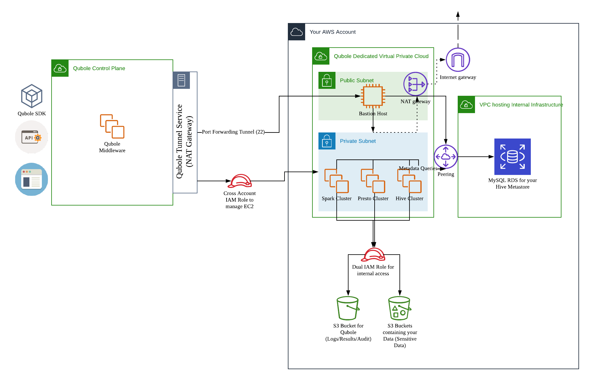

# Terraform: Qubole Deployment 

<h2>What is <a href="https://www.terraform.io/">Terraform</a>?</h2>

    Terraform is a tool for building, changing, and versioning infrastructure safely and efficiently. 
    Terraform can manage existing and popular service providers as well as custom in-house solutions.

<h2>What is <a href="https://www.qubole.com/">Qubole</a>?</h2>

    Qubole is a Single platform for end-to-end big data processing
    It is the only cloud-native platform to deliver deep analytics, AI, and machine learning for your big data. 
    It provides easy-to-use end user tools such as SQL query tools, notebooks, and dashboards that leverage powerful open source engines. 
    Qubole provides a single, shared infrastructure that enables users to more efficiently conduct ETL, analytics, and AI/ML workloads 
    across best-of-breed open source engines including Apache Spark, TensorFlow, Presto, Airflow, Hadoop, Hive, and more.

<h2>What is the purpose of this project?</h2>

    When an organization or a customer wants to use Qubole on AWS, they need to integrate their AWS Account with Qubole. This includes
    
    * IAM permissions
        * Compute
        * Storage
        * Trust Relations
    * Dedicated networking components
        * VPC
        * Subnets
        * Security Groups
        * NAT Gateways
        * Internet Gateways
        * Routes
    * Hive Metastore
    
    That said, The purpose of this project is two-fold
    Using the DRY principle promoted by Terraform, create re-usable, customizable Terraform modules that
    1. Create IAM Roles, Service Accounts and Policies that 
        i. Allow Qubole to Create Clusters and perform complete life cycle management
        ii. Allow the clusters to write audit data, command logs/results/resources onto S3
    2. Create infrastructure dedicated for use by Qubole(hence isolating it from other resources)
        i. A dedicated VPC network with a public and private subnet
        ii. A bastion host for securing communications with Qubole
        iii. A NAT Gateway to secure outbound communications in the private subnet
        iv. Associated security group rules to secure inter-component communications
        
    Additionally, the project also contains a module to spin up a Hive Metastore if the customer or organization does not already have one.
    The module will do the following
    1. Create an RDS Instance (MySQL) with a database configured as the Hive Metastore (No Public accessibility)
    2. Initialize it with the schema required for it to work as a metastore
    3. Establish Private - VPC Peered connectivity between the Qubole Components and the RDS

       

<h2>How does the integration look like?</h2>

    

<h2>How to use the project?</h2>

    All the modules are tf files(in HCL) in the modules folder. Each tf file has detailed documentation on its purpose in life and its use to the Qubole deployment
    The main.tf can be customized to cherry pick which modules to deploy.

    There are 3 modules
    1. The account_integration module
        i. Setup a cross account IAM role with EC2 policy, S3 policy and Cross Account Policy
        ii. Setup a dual IAM role with instance profile with EC2 policy and S3 policy
        iii. Allows Qubole to use the Cross Account IAM role
        iv. Setup a service account that will act as the Instance Service Account
        v. Authorize the Cross Account Role to be able to pass the Dual IAM role and Instance Profile to clusters
        viii. Create a S3 Bucket which will be the account's Default Location
    2. The network_infrastructure module
        i. Setup a VPC with a public and private subnet
        ii. Setup a Bastion host in the public subnet and whitelist Qubole ingress to it
        iii. Initialize the Bastion with a key pair using the local id_rsa
        iv. Setup a NAT Gateway, Internet Gateway and Route Table to allow clusters spun up in the private subnet access to the internet
    3. The hive_metastore module
        i. Setup a VPC dedicated for the Metastore without any DNS support 
        ii. Setup an RDS Instance hosting the Hive Metastore, without any public access
        iii. Peer the VPC to the Qubole Dedicated VPC for secure access
        iii. Whitelist Bastion ingress and private subnet ingress to the RDS instance
        iv. Initialize the Metastore DB with the required schema

    Deploy the modules as follows
    1. Navigate to the qubole-deployment folder
    2. Edit the main.tf to choose which modules to deploy
    3. Add the credentials file with AWS credentials to be used by Terraform at ./aws_credentials (if not, the machine's credentials will be used)
    4. Review the variables in each module and update as required
    5. terraform init
    6. terraform plan
    7. terraform apply

That's all folks
