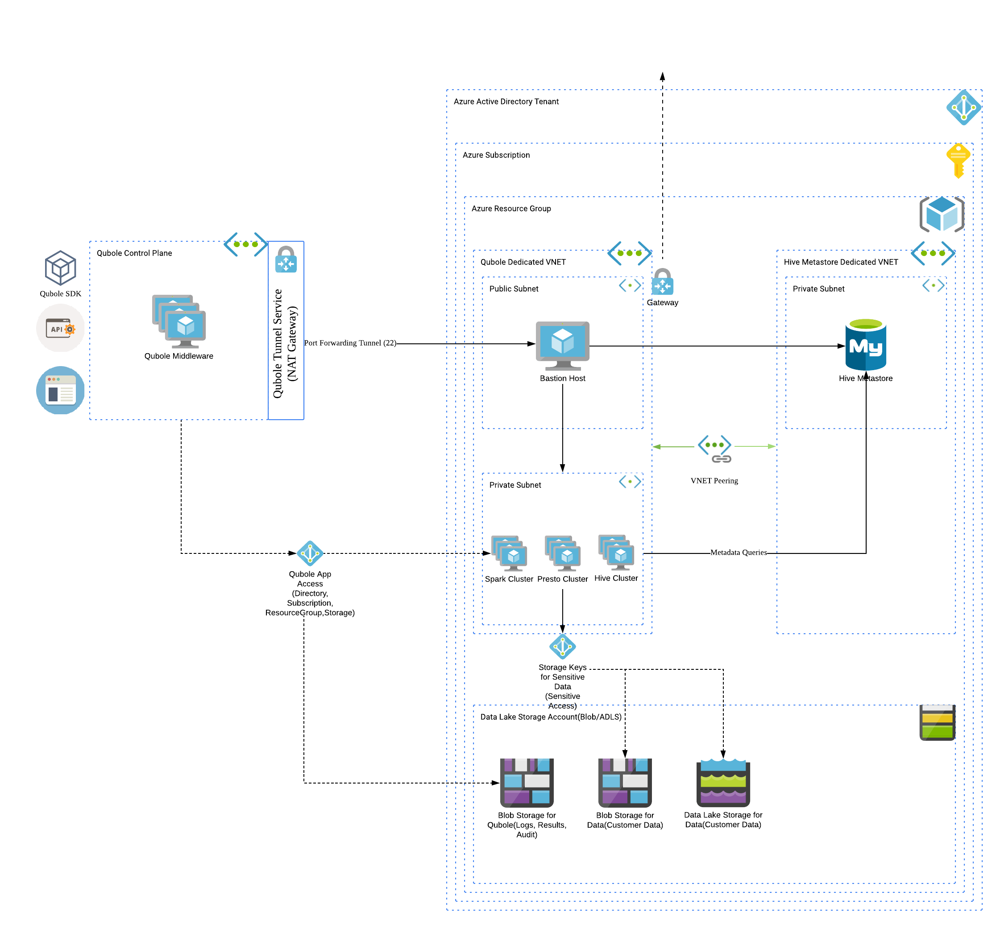

# Terraform: Qubole Deployment 

<h2>What is <a href="https://www.terraform.io/">Terraform</a>?</h2>

    Terraform is a tool for building, changing, and versioning infrastructure safely and efficiently. 
    Terraform can manage existing and popular service providers as well as custom in-house solutions.

<h2>What is <a href="https://www.qubole.com/">Qubole</a>?</h2>

    Qubole is a Single platform for end-to-end big data processing
    It is the only cloud-native platform to deliver deep analytics, AI, and machine learning for your big data. 
    It provides easy-to-use end user tools such as SQL query tools, notebooks, and dashboards that leverage powerful open source engines. 
    Qubole provides a single, shared infrastructure that enables users to more efficiently conduct ETL, analytics, and AI/ML workloads 
    across best-of-breed open source engines including Apache Spark, TensorFlow, Presto, Airflow, Hadoop, Hive, and more.

<h2>What is the purpose of this project?</h2>

    When an organization or a customer wants to use Qubole on Azure, they need to integrate their Azure Account with Qubole. This includes
    
    * Azure Active Directory Application
        * Resource Groups
    * Storage Account(BlobStorage, ADLS)
    * Dedicated networking components
        * VNET
        * Subnets
        * Network Security Groups   
    * Hive Metastore
    
    That said, The purpose of this project is two-fold
    Using the DRY principle promoted by Terraform, create re-usable, customizable Terraform modules that
    1. Create Azure Active Directory Application 
        i. Allow a Qubole Dedicate Resource Group to contribute to this
        ii. Allow the clusters to write audit data, command logs/results/resources onto BlobStorage
    2. Create infrastructure dedicated for use by Qubole(hence isolating it from other resources)
        i. A dedicated Virtual network with a public and private subnet
        ii. A bastion host for securing communications with Qubole
        iii. Associated network security group rules to secure inter-component communications

       

<h2>How does the integration look like?</h2>

    

<h2>How to use the project?</h2>

    All the modules are tf files(in HCL) in the modules folder. Each tf file has detailed documentation on its purpose in life and its use to the Qubole deployment
    The main.tf can be customized to cherry pick which modules to deploy.

    Pre-requisites:
    <ol>
        <li>
            Azure Subscription ID to use:
            <ul>
                <li>
                    In the main.tf, you can specify the subscription id to use for this setup.
                </li>
                <li>
                    This can be important if you have multiple subscriptions going on.
                </li>
            </ul>
        </li>
        <li>
            Account Level SSH Key:
            <ul>
                <li>
                    See https://docs.qubole.com/en/latest/admin-guide/cluster-admin/private-subnet.html#configuring-a-private-subnet-for-azure-clusters
                </li>
                <li>
                    Use https://docs.qubole.com/en/latest/rest-api/account_api/account-SSH-key.html to get this unique SSH Key
                </li>
            </ul>
        </li>
        <li>
            Qubole Default Public Key
            <ul>
                <li>
                    See Step 3a at https://docs.qubole.com/en/latest/admin-guide/cluster-admin/private-subnet.html#configuring-a-private-subnet-for-azure-clusters
                </li>
            </ul>
        </li>
    </ol>

    There are 2 modules
    1. The account_integration module
        i. Setup an Azure Active Directory Application
        ii. Setup a Qubole dedicated Resource Group
        iii. Allow the application to Contribute to the Resource Group
        iv. Setup a Storage Account, and a contrainer to serve as the account's default location
    2. The network_infrastructure module
        i. Setup a VNET with a public and private subnet
        ii. Setup a Bastion host in the public subnet and whitelist Qubole ingress to it
        iii. Initialize the Bastion with a SSH keys belonging to the account
       

    Deploy the modules as follows
    1. Navigate to the qubole-deployment folder
    2. Edit the main.tf to choose which modules to deploy
    3. Review the variables in each module and update as required
    4. terraform init
    5. terraform plan
    6. terraform apply

Upon successful application, Terraform will print out all the necessary items required for account integration and network integration.
Use them in the account settings and cluster pages respectively to get started.

That's all folks
